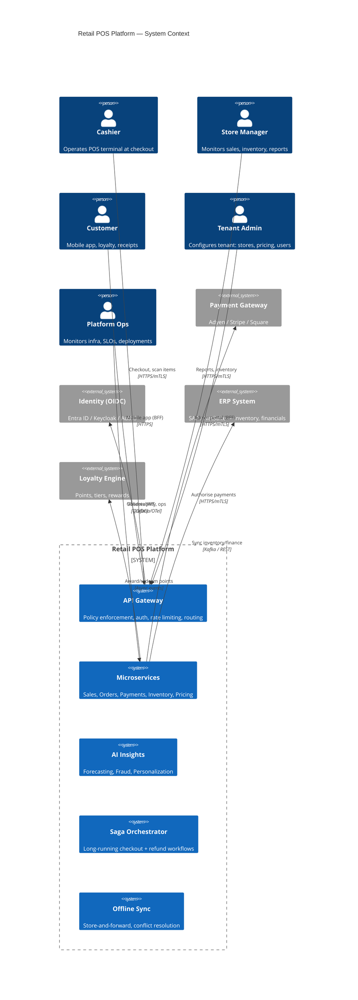
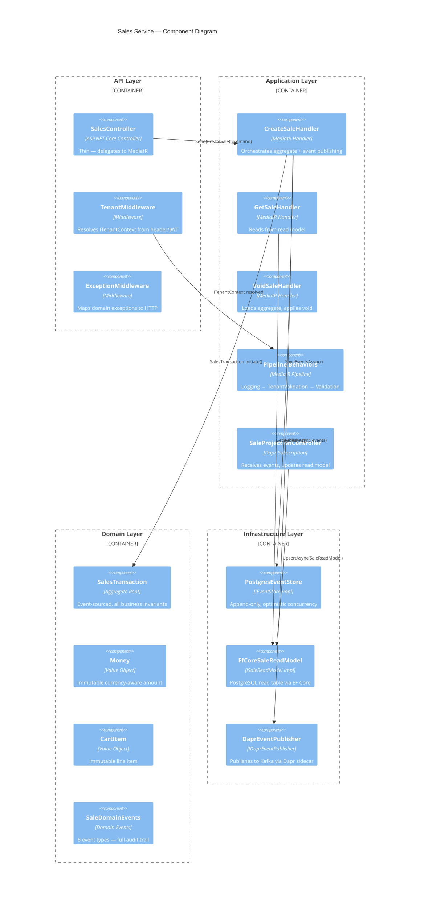

# C4 Architecture Diagrams — Retail POS Platform

## Level 1: System Context

```mermaid
C4Context
    title Retail POS Platform — System Context

    Person(cashier,       "Cashier",       "Operates POS terminal at checkout")
    Person(manager,       "Store Manager", "Monitors sales, inventory, reports")
    Person(customer,      "Customer",      "Mobile app, loyalty, receipts")
    Person(tenant_admin,  "Tenant Admin",  "Configures tenant: stores, pricing, users")
    Person(platform_ops,  "Platform Ops",  "Monitors infra, SLOs, deployments")

    System_Boundary(pos, "Retail POS Platform") {
        System(gateway,    "API Gateway",      "Policy enforcement, auth, rate limiting, routing")
        System(services,   "Microservices",    "Sales, Orders, Payments, Inventory, Pricing")
        System(ai,         "AI Insights",      "Forecasting, Fraud, Personalization")
        System(sagas,      "Saga Orchestrator","Long-running checkout + refund workflows")
        System(offline,    "Offline Sync",     "Store-and-forward, conflict resolution")
    }

    System_Ext(payment_gw,    "Payment Gateway", "Adyen / Stripe / Square")
    System_Ext(oidc_provider, "Identity (OIDC)", "Entra ID / Keycloak / Auth0")
    System_Ext(erp,           "ERP System",      "SAP / NetSuite — inventory, financials")
    System_Ext(loyalty,       "Loyalty Engine",  "Points, tiers, rewards")

    Rel(cashier,      gateway,  "Checkout, scan items",    "HTTPS/mTLS")
    Rel(manager,      gateway,  "Reports, inventory",      "HTTPS/mTLS")
    Rel(customer,     gateway,  "Mobile app (BFF)",        "HTTPS")
    Rel(tenant_admin, gateway,  "Admin portal (BFF)",      "HTTPS/mTLS")
    Rel(platform_ops, services, "Observability, ops",      "Grafana/OTel")

    Rel(services, payment_gw,   "Authorise payments",      "HTTPS/mTLS")
    Rel(gateway,  oidc_provider,"Validate JWT",            "OIDC")
    Rel(services, erp,          "Sync inventory/finance",  "Kafka / REST")
    Rel(services, loyalty,      "Award/redeem points",     "Async events")
```

---

## Level 2: Container Diagram

```mermaid
C4Container
    title Retail POS Platform — Containers

    Person(cashier, "Cashier / POS Terminal")
    Person(manager, "Store Manager")
    Person(customer, "Customer (Mobile)")

    System_Boundary(edge, "Edge Layer") {
        Container(gateway, "API Gateway", "ASP.NET Core + YARP", "Policy enforcement, JWT auth, rate limiting, routing")
        Container(bff_pos, "POS BFF", "ASP.NET Core", "Aggregates Sales+Pricing+Inventory for terminal — one call checkout")
        Container(bff_web, "Web BFF", "ASP.NET Core", "Dashboard aggregation for manager portal")
        Container(bff_mob, "Mobile BFF", "ASP.NET Core", "Lightweight responses for customer mobile app")
    }

    System_Boundary(services_layer, "Service Layer") {
        Container(sales,     "Sales Service",     "ASP.NET Core", "Checkout, CQRS + Event Sourcing")
        Container(orders,    "Orders Service",    "ASP.NET Core", "Order lifecycle")
        Container(payments,  "Payments Service",  "ASP.NET Core", "Payment authorisation")
        Container(inventory, "Inventory Service", "ASP.NET Core", "Stock tracking")
        Container(pricing,   "Pricing Service",   "ASP.NET Core", "Promotions, rules engine")
        Container(store_mgmt,"Store Management",  "ASP.NET Core", "Store/terminal config")
        Container(pci,       "Tokenization API",  "ASP.NET Core", "PCI-scoped, isolated network segment")
    }

    System_Boundary(workers, "Worker Layer (ASP.NET Core Hosted)") {
        Container(proj_worker,  "Projection Worker",    "IHostedService", "Catch-up event projections")
        Container(saga_svc,     "Checkout Saga Host",   "Dapr Workflow",  "Orchestrates inventory+payment+sale")
        Container(sync_worker,  "Store-and-Forward",    "IHostedService", "Offline sync, conflict resolution")
        Container(slo_worker,   "SLO Evaluation Worker","IHostedService", "Per-tenant SLO monitoring")
    }

    System_Boundary(data, "Data Layer") {
        ContainerDb(event_store, "Event Store",  "PostgreSQL", "Append-only event log (per-tenant schema)")
        ContainerDb(read_models, "Read Models",  "PostgreSQL", "Denormalized query tables (per-tenant schema)")
        ContainerDb(redis,       "Redis",        "Redis 7",    "Dapr state, rate limiting, session")
        ContainerDb(kafka,       "Kafka",        "Strimzi",    "Durable event backbone, 5 topics")
    }

    System_Boundary(platform, "Platform Layer") {
        Container(otel,    "OTel Collector", "OpenTelemetry", "Traces, metrics, logs")
        Container(ai_svc,  "AI Insights",    "ASP.NET Core",  "Forecasting, fraud, personalization")
    }

    Rel(cashier,  gateway,   "API calls",          "HTTPS")
    Rel(gateway,  bff_pos,   "Route /bff/pos/**",  "HTTP")
    Rel(gateway,  sales,     "Route /api/v1/sales","HTTP")
    Rel(bff_pos,  sales,     "Typed HTTP client",  "HTTP + Dapr")
    Rel(bff_pos,  pricing,   "Live pricing",       "HTTP + Dapr")
    Rel(sales,    event_store,"Persist events",    "EF Core")
    Rel(sales,    kafka,      "Publish via Dapr",  "Dapr pub/sub")
    Rel(kafka,    proj_worker,"Consume events",    "Kafka consumer")
    Rel(proj_worker, read_models,"Update read model","EF Core")
    Rel(saga_svc, inventory, "Reserve stock",      "HTTP + idempotency")
    Rel(saga_svc, payments,  "Authorise payment",  "HTTP + idempotency")
    Rel(pci,      redis,     "Token vault",        "Encrypted")
```

---

## Level 3: Sales Service Components

```mermaid
C4Component
    title Sales Service — Component Diagram

    Container_Boundary(api_layer, "API Layer") {
        Component(controller, "SalesController", "ASP.NET Core Controller", "Thin — delegates to MediatR")
        Component(tenant_mw,  "TenantMiddleware", "Middleware", "Resolves ITenantContext from header/JWT")
        Component(exc_mw,     "ExceptionMiddleware", "Middleware", "Maps domain exceptions to HTTP")
    }

    Container_Boundary(app_layer, "Application Layer") {
        Component(create_handler, "CreateSaleHandler", "MediatR Handler", "Orchestrates aggregate + event publishing")
        Component(get_handler,    "GetSaleHandler",    "MediatR Handler", "Reads from read model")
        Component(void_handler,   "VoidSaleHandler",   "MediatR Handler", "Loads aggregate, applies void")
        Component(behaviors,      "Pipeline Behaviors", "MediatR Pipeline", "Logging → TenantValidation → Validation")
        Component(projection,     "SaleProjectionController", "Dapr Subscription", "Receives events, updates read model")
    }

    Container_Boundary(domain_layer, "Domain Layer") {
        Component(aggregate, "SalesTransaction", "Aggregate Root", "Event-sourced, all business invariants")
        Component(money_vo,  "Money",            "Value Object",   "Immutable currency-aware amount")
        Component(item_vo,   "CartItem",         "Value Object",   "Immutable line item")
        Component(events,    "SaleDomainEvents", "Domain Events",  "8 event types — full audit trail")
    }

    Container_Boundary(infra_layer, "Infrastructure Layer") {
        Component(event_store, "PostgresEventStore", "IEventStore impl", "Append-only, optimistic concurrency")
        Component(read_repo,   "EfCoreSaleReadModel","ISaleReadModel impl","PostgreSQL read table via EF Core")
        Component(dapr_pub,    "DaprEventPublisher", "IDaprEventPublisher","Publishes to Kafka via Dapr sidecar")
    }

    Rel(controller, create_handler, "Send(CreateSaleCommand)")
    Rel(create_handler, aggregate,  "SalesTransaction.Initiate()")
    Rel(create_handler, event_store,"SaveEventsAsync()")
    Rel(create_handler, dapr_pub,   "PublishAsync(events)")
    Rel(get_handler, read_repo,     "GetByIdAsync()")
    Rel(projection, read_repo,      "UpsertAsync(SaleReadModel)")
    Rel(tenant_mw, behaviors,       "ITenantContext resolved")
```
