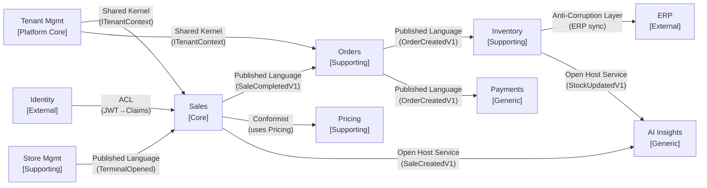

# DDD Bounded Contexts & Context Map

## Bounded Context Overview

```
┌─────────────────────────────────────────────────────────────────────────────────┐
│                    RETAIL POS DOMAIN                                            │
│                                                                                 │
│  ┌───────────────────┐    ┌───────────────────┐    ┌───────────────────┐       │
│  │   SALES CONTEXT   │    │   ORDER CONTEXT   │    │ PAYMENT CONTEXT   │       │
│  │                   │    │                   │    │                   │       │
│  │  SalesTransaction │    │  Order            │    │  Payment          │       │
│  │  CartItem         │    │  OrderLine        │    │  Refund           │       │
│  │  Receipt          │    │  Fulfilment       │    │  Token            │       │
│  │  CashierSession   │    │                   │    │                   │       │
│  │                   │    │  ← SaleCompleted  │    │  ← OrderCreated   │       │
│  │ [Core Domain]     │    │ [Supporting]      │    │ [Generic]         │       │
│  └───────────────────┘    └───────────────────┘    └───────────────────┘       │
│                                                                                 │
│  ┌───────────────────┐    ┌───────────────────┐    ┌───────────────────┐       │
│  │ INVENTORY CONTEXT │    │ PRICING CONTEXT   │    │  STORE MGMT CTX   │       │
│  │                   │    │                   │    │                   │       │
│  │  InventoryItem    │    │  PriceRule        │    │  Store            │       │
│  │  StockLevel       │    │  Promotion        │    │  Terminal         │       │
│  │  Reservation      │    │  DiscountCode     │    │  CashierSession   │       │
│  │  Replenishment    │    │  TaxRule          │    │  ShiftReport      │       │
│  │                   │    │                   │    │                   │       │
│  │ [Supporting]      │    │ [Supporting]      │    │ [Supporting]      │       │
│  └───────────────────┘    └───────────────────┘    └───────────────────┘       │
│                                                                                 │
│  ┌───────────────────┐    ┌───────────────────┐    ┌───────────────────┐       │
│  │  AI INSIGHTS CTX  │    │  TENANT MGMT CTX  │    │ IDENTITY CONTEXT  │       │
│  │                   │    │                   │    │                   │       │
│  │  Forecast         │    │  Tenant           │    │  User             │       │
│  │  FraudScore       │    │  Subscription     │    │  Role             │       │
│  │  Recommendation   │    │  FeatureFlag      │    │  Permission       │       │
│  │  AlertRule        │    │  SLO              │    │                   │       │
│  │                   │    │                   │    │  [External OIDC]  │       │
│  │ [Generic]         │    │ [Core Platform]   │    │                   │       │
│  └───────────────────┘    └───────────────────┘    └───────────────────┘       │
└─────────────────────────────────────────────────────────────────────────────────┘
```

## Context Map — Relationships



## Domain Classification

| Bounded Context | Type | Rationale |
|---|---|---|
| Sales | **Core Domain** | Primary differentiator — custom CQRS+ES investment |
| Tenant Management | **Core Platform** | Multi-tenancy is a platform capability |
| Orders | **Supporting** | Important but not unique — standard order model |
| Inventory | **Supporting** | Catalog + stock — ERP integration point |
| Pricing | **Supporting** | Complex rules, but off-the-shelf alternatives exist |
| Payments | **Generic** | Use payment gateway — no proprietary advantage |
| Identity | **Generic** | Delegated to OIDC provider (external) |
| AI Insights | **Generic** | Pluggable ML platform — not core differentiator |

## Aggregates Per Context

### Sales Context
```
SalesTransaction (aggregate root)
  ├── CartItem (value object, collection)
  ├── Money (value object)
  ├── Receipt (value object)
  └── SaleStatus (enum: Active, Completed, Voided, Refunded)

Domain Events:
  SaleInitiated → SaleItemAdded → DiscountApplied → SaleCompleted
  SaleVoided | SaleRefunded
```

### Orders Context
```
Order (aggregate root)
  ├── OrderLine (value object, collection)
  └── OrderStatus (Pending, Fulfilled, Cancelled)

Domain Events:
  OrderCreated → OrderFulfilled | OrderCancelled
```

### Payments Context
```
Payment (aggregate root)
  ├── PaymentMethod (value object: CARD, CASH, WALLET)
  ├── Token (value object — no PAN stored)
  └── PaymentStatus (Pending, Authorised, Declined, Refunded)

Domain Events:
  PaymentInitiated → PaymentAuthorised | PaymentDeclined
  RefundProcessed
```

### Inventory Context
```
InventoryItem (aggregate root)
  ├── StockLevel (value object)
  ├── ReorderThreshold (value object)
  └── Reservation (entity — has lifecycle)

Domain Events:
  StockDeducted → StockReplenished → StockReserved
  StockReleased → LowStockAlert
```
