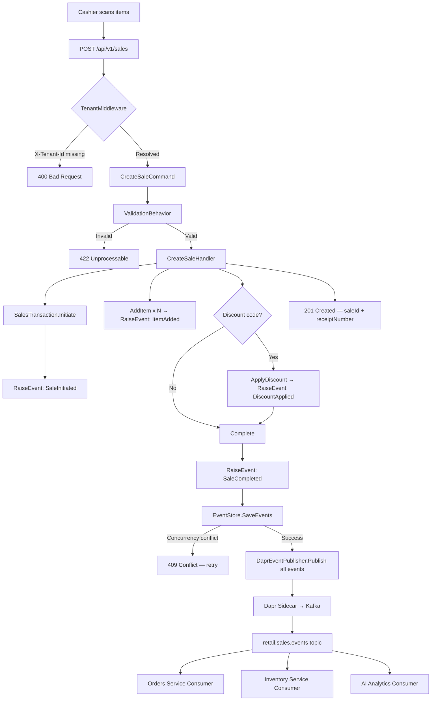

# Event-Driven Workflow Documentation

## 1. Complete Checkout Flow



---

## 2. Cross-Service Saga: Checkout → Order → Stock → Payment

```
┌─────────────────────────────────────────────────────────────────────────────┐
│                      CHECKOUT SAGA (Choreography)                           │
│                                                                             │
│  1. Sales Service                                                           │
│     [SaleCompleted] ──────────────────────────► retail.sales.events        │
│                                                         │                  │
│  2. Orders Service                                      ▼                  │
│     Consumes [SaleCompleted]                    [OrderCreated]              │
│     Creates Order aggregate                     ──► retail.orders.events   │
│                                                         │                  │
│  3. Inventory Service                                   ▼                  │
│     Consumes [OrderCreated]                     [StockReserved] or         │
│     Deducts stock per line item                 [StockInsufficient]        │
│     ────────────────────────────────────────► retail.inventory.events     │
│                                                         │                  │
│  4a. Stock OK: Payments Service                         ▼                  │
│     Consumes [StockReserved]                    [PaymentAuthorised] or     │
│     Authorises payment                          [PaymentDeclined]          │
│     ────────────────────────────────────────► retail.payments.events      │
│                                                         │                  │
│  4b. Stock INSUFFICIENT: Compensation                   │                  │
│     Orders Service consumes [StockInsufficient]         │                  │
│     Cancels order → publishes [OrderCancelled]          │                  │
│     Sales Service compensates → issues refund           │                  │
│                                                         │                  │
│  5. Notification / Analytics                            ▼                  │
│     AI Service consumes all events → updates dashboards                    │
└─────────────────────────────────────────────────────────────────────────────┘
```

---

## 3. Event Ordering and Partitioning

```
Kafka Partition Strategy:
  Key: tenant-id + (store-id optional)
  Effect: All events for a tenant are in the same partition
          → Guaranteed ordering within a tenant
          → No cross-tenant ordering guarantees (not needed)

Partition count: 24 (for retail.sales.events)
  Rationale: supports up to 24 consumer threads for parallel processing
             across tenants without out-of-order risk per tenant

Consumer Groups:
  orders-consumer-group     → reads retail.sales.events
  inventory-consumer-group  → reads retail.orders.events
  payments-consumer-group   → reads retail.inventory.events
  ai-consumer-group         → reads ALL topics
  projection-group          → reads ALL topics (for read model updates)
```

---

## 4. Failure Handling Matrix

| Failure Scenario | Detection | Recovery | Idempotency |
|---|---|---|---|
| Event Store write fails | Exception in handler | Return 500, retry | Not needed (never written) |
| Kafka publish fails | Dapr retry exhausted | Dead Letter Queue | EventId dedup |
| Projection consumer crash | Kafka lag alert | Auto-restart, replay | UPSERT by SaleId |
| Concurrency conflict | ConcurrencyException | 409 → client retry | expectedVersion check |
| Payment declined | PaymentDeclinedEvent | Compensating saga | Saga correlation ID |
| Stock insufficient | StockInsufficientEvent | OrderCancelled saga | Saga correlation ID |
| Schema mismatch | Deserialize error | DLQ + alert | Unknown field tolerance |

---

## 5. Schema Evolution: Adding Fields to SaleCreatedV1

```
Step 1 — Additive change (backward compatible):
  Add optional field to SaleCreatedV1:
  + public string? LoyaltyTier { get; init; }   // null in old messages

Step 2 — Producers start sending new field
  All consumers already deployed → they ignore unknown fields (or default null)
  No consumer changes required

Step 3 — Consumers optionally use new field
  Update read model projection to handle LoyaltyTier

Breaking change — requires V2:
  Rename CustomerId → BuyerId

Step 1: Create SaleCreatedV2 with BuyerId
Step 2: Producer dual-publishes V1 + V2 for 2 weeks
Step 3: All consumers updated to handle V2
Step 4: Producer stops publishing V1
Step 5: V1 consumer code removed after retention period
```
