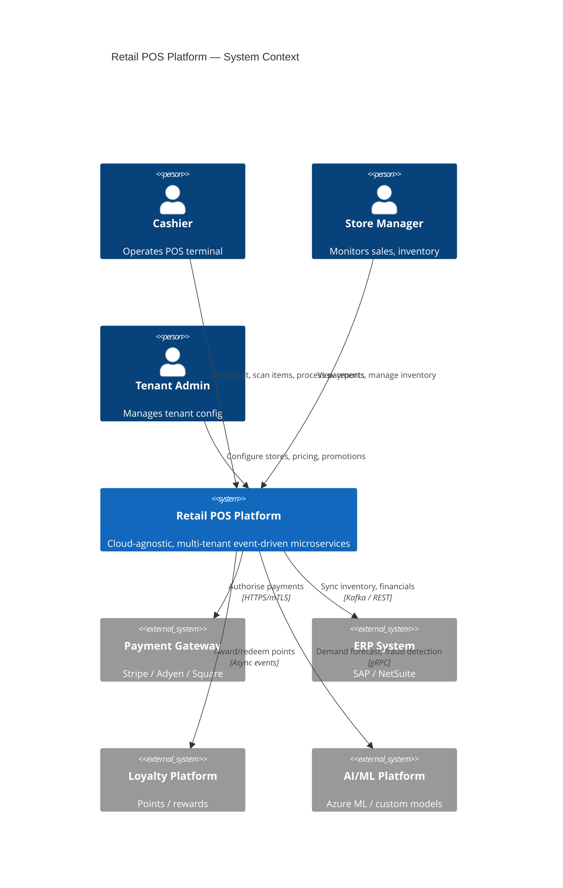
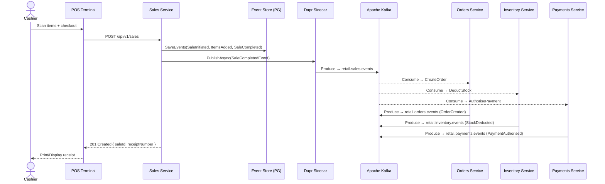

# High-Level Design — Retail POS Platform

## 1. System Context



---

## 2. Architecture Overview

```
┌─────────────────────────────────────────────────────────────────────────────────────────────────┐
│                                  RETAIL POS PLATFORM                                            │
│                                                                                                 │
│  ┌───────────────────────────────────────────────────────────────────────────────────────────┐  │
│  │                           API GATEWAY LAYER                                               │  │
│  │   Kubernetes Ingress + NGINX / Envoy / Kong (cloud-agnostic)                             │  │
│  │   • JWT/mTLS auth  • Rate limiting (per tenant)  • Request routing  • TLS termination    │  │
│  └─────────────────────────────────────┬─────────────────────────────────────────────────────┘  │
│                                        │                                                        │
│     ┌──────────────┬──────────────┬────┴──────────┬──────────────┬──────────────┐              │
│     │              │              │               │              │              │              │
│     ▼              ▼              ▼               ▼              ▼              ▼              │
│  ┌──────┐      ┌──────┐      ┌──────┐        ┌──────┐      ┌──────┐      ┌──────┐            │
│  │SALES │      │ORDER │      │PAYMNT│        │INVTRY│      │PRICNG│      │STORE │            │
│  │SVC   │      │SVC   │      │SVC   │        │SVC   │      │SVC   │      │MGMT  │            │
│  │      │      │      │      │      │        │      │      │      │      │SVC   │            │
│  │ CQRS │      │ CQRS │      │ CQRS │        │ CQRS │      │ CQRS │      │ CRUD │            │
│  │ ES   │      │ ES   │      │ ES   │        │ ES   │      │Rules │      │      │            │
│  └──┬───┘      └──┬───┘      └──┬───┘        └──┬───┘      └──────┘      └──────┘            │
│     │             │             │               │                                             │
│     │             │   DAPR SIDECARS (per pod)   │                                             │
│     │             │  pub/sub · state · secrets   │                                             │
│     └─────────────┴─────────────┴───────────────┘                                             │
│                               │                                                                │
│     ┌─────────────────────────▼──────────────────────────────────────────┐                    │
│     │              APACHE KAFKA (Event Backbone)                          │                    │
│     │                                                                     │                    │
│     │  retail.sales.events   retail.orders.events   retail.payments.events│                    │
│     │  retail.inventory.events   retail.pricing.events                    │                    │
│     │                                                                     │                    │
│     │  Strimzi Operator  |  3 brokers  |  Schema Registry  |  Kafka UI   │                    │
│     └──────────────────────────────────┬────────────────────────────────-┘                    │
│                                        │                                                       │
│     ┌──────────────────────────────────▼──────────────────────┐                               │
│     │              AI / ANALYTICS LAYER                        │                               │
│     │  Demand Forecasting  │  Fraud Detection  │ Personalization│                               │
│     │  Sales Analytics     │  Inventory Alerts │  ML Pipelines  │                               │
│     └──────────────────────────────────────────────────────────┘                               │
│                                                                                                 │
│  ┌────────────────────────────────────────────────────────────────────────────────────────┐    │
│  │                         PLATFORM SERVICES                                              │    │
│  │  PostgreSQL (per-tenant schema)  │  Redis  │  OTEL Collector  │  Jaeger  │  Grafana   │    │
│  │  Prometheus  │  AlertManager  │  Vault / K8s Secrets  │  Cert-Manager                 │    │
│  └────────────────────────────────────────────────────────────────────────────────────────┘    │
└─────────────────────────────────────────────────────────────────────────────────────────────────┘
```

---

## 3. Event-Driven Architecture



---

## 4. Multi-Tenancy Model

```
                    TENANT ISOLATION BOUNDARY
                    ┌────────────────────────────────────┐
  Tenant: ACME      │  PostgreSQL Schema: tenant_acme    │
                    │  Redis Keyspace: acme:*             │
                    │  Kafka Headers: tenant-id=acme      │
                    └────────────────────────────────────┘
                    ┌────────────────────────────────────┐
  Tenant: BETA      │  PostgreSQL Schema: tenant_beta    │
                    │  Redis Keyspace: beta:*             │
                    │  Kafka Headers: tenant-id=beta      │
                    └────────────────────────────────────┘

Propagation chain:
  HTTP Header (X-Tenant-Id)
    → TenantMiddleware → ITenantContext (scoped DI)
      → MediatR TenantValidationBehavior
        → EF Core schema search_path
          → Dapr event metadata (tenant-id)
            → Kafka message header (tenant-id)
              → Consumer → ITenantContext re-resolved
```

---

## 5. Observability Stack

```
┌─────────────────────────────────────────────────────────────────────┐
│                    OBSERVABILITY                                     │
│                                                                     │
│  [Service]                                                          │
│    │─ Serilog → OTLP Exporter                                      │
│    │─ Metrics: asp.net core + custom                                │
│    │─ Traces: ActivitySource "RetailPos.*"                          │
│    ▼                                                                │
│  OpenTelemetry Collector                                            │
│    │─────────────► Jaeger (distributed traces)                     │
│    │─────────────► Prometheus (metrics)                             │
│    │─────────────► Loki (logs)                                      │
│    │─────────────► Cloud vendor (Azure Monitor, Datadog — optional) │
│    ▼                                                                │
│  Grafana Dashboard                                                  │
│    │─ Service map (RED metrics)                                     │
│    │─ Kafka consumer lag                                            │
│    │─ Event store write rate                                        │
│    │─ Per-tenant transaction volume                                 │
└─────────────────────────────────────────────────────────────────────┘
```

---

## 6. Deployment Topology

```
Kubernetes Cluster (CNCF-compliant: AKS / EKS / GKE / On-prem)
┌──────────────────────────────────────────────────────────────────────┐
│  Namespace: retail-pos                                               │
│  ┌──────────────┐ ┌──────────────┐ ┌──────────────┐                │
│  │ sales-svc x3 │ │ orders-svc x2│ │payments-svc x3│               │
│  │ +dapr sidecar│ │ +dapr sidecar│ │ +dapr sidecar │               │
│  └──────────────┘ └──────────────┘ └──────────────┘                │
│  ┌──────────────┐ ┌──────────────┐ ┌──────────────┐                │
│  │inventory-svc │ │ pricing-svc  │ │ ai-insights  │                │
│  │ +dapr sidecar│ │ +dapr sidecar│ │   service    │                │
│  └──────────────┘ └──────────────┘ └──────────────┘                │
│                                                                      │
│  Namespace: kafka                                                    │
│  ┌─────────────────────────────────────┐                            │
│  │ Strimzi Kafka 3 brokers + ZooKeeper │                            │
│  │ Schema Registry + Kafka UI          │                            │
│  └─────────────────────────────────────┘                            │
│                                                                      │
│  Namespace: dapr-system                                              │
│  ┌─────────────────────────────────────┐                            │
│  │ Dapr Control Plane (operator, sentry,│                           │
│  │  placement, dashboard)              │                            │
│  └─────────────────────────────────────┘                            │
│                                                                      │
│  Namespace: observability                                            │
│  ┌─────────────────────────────────────┐                            │
│  │ OTel Collector + Jaeger + Prometheus │                           │
│  │ Grafana + Loki + AlertManager        │                           │
│  └─────────────────────────────────────┘                            │
└──────────────────────────────────────────────────────────────────────┘
```
