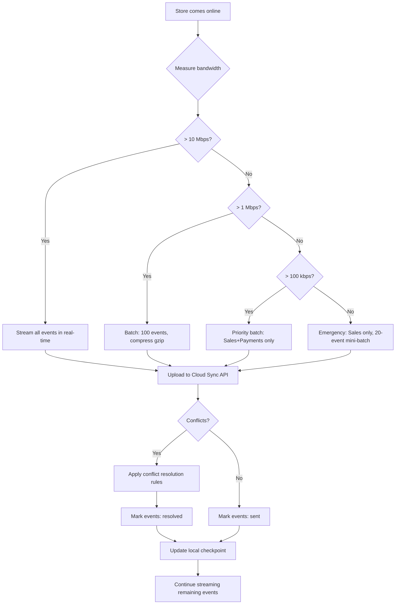

# Offline-First Retail Architecture

## Problem Statement

Retail stores lose network connectivity. This must be a **non-event** for store operations:
- Checkout must continue
- Payments must process (card-present offline approval)
- Inventory must be tracked locally
- All events must eventually sync to cloud

---

## Offline Architecture

```
ONLINE MODE                          OFFLINE MODE
─────────────────────────────────    ────────────────────────────────────
POS Terminal                         POS Terminal
    │ HTTPS                              │
    ▼                                   ▼ (no cloud)
Cloud API Gateway              Local Event Buffer (SQLite)
    │                                   │
    ▼                                   │ Local processing only
Sales Service (cloud)          Local Price Cache (15-min TTL)
    │                                   │
    ▼                                   │ Offline payment approval
Event Store (cloud PG)         Floor limit: $100 (configurable)
                                        │
                               Events queued in priority order:
                                   1. Sales (highest priority)
                                   2. Payments
                                   3. Inventory
                                   4. Telemetry (lowest priority)
                                        │
                               ─── Connectivity Restored ────
                                        │
                                        ▼
                               StoreAndForwardWorker activates
                                   Measure bandwidth
                                   Choose sync strategy
                                   Compress + upload batch
                                   Conflict detection
                                   Mark events sent
```

---

## Sync Strategies by Bandwidth

| Bandwidth | Strategy | What Syncs |
|---|---|---|
| > 10 Mbps | Streaming | All events, real-time |
| 1–10 Mbps | Batched | All events, 100-event batches |
| 100 kbps–1 Mbps | Priority batched | Sales + Payments first |
| < 100 kbps | Emergency | Sales only (survival mode) |
| 0 | Offline | Buffer only, no sync |

---

## Conflict Detection & Resolution

```
Conflict Scenarios:

1. PRICE CHANGED DURING OFFLINE PERIOD
   Store applied old price → Cloud has new price
   Resolution: SERVER WINS (pricing policy enforced at cloud)
   Action: Adjust transaction, notify customer if significant

2. INVENTORY OVERSOLD
   Store sold 5 units, only 3 in stock (sold by another store)
   Resolution: STORE WINS (sale stands, inventory adjusted)
   Action: Trigger replenishment, alert manager

3. DUPLICATE EVENT (idempotency)
   Event re-sent during sync (network timeout)
   Resolution: IDEMPOTENT (EventId dedup, UPSERT in projections)
   Action: Discard duplicate silently

4. CLOCK SKEW
   Store clock drifted during offline period
   Resolution: Events timestamped with BOTH store_time and sync_time
   Action: Flag for audit, use sync_time for ordering

5. PAYMENT TOKEN EXPIRY
   Offline card approval token expired by sync time
   Resolution: Re-authorise if token expired, mark as pending
   Action: Alert store manager
```

---

## Store-to-Cloud Sync Flow



---

## Offline Payment Approval

```
Card-present offline approval strategy:
  1. Terminal has floor limit: $100 (PCI-compliant configurable)
  2. For amounts > floor limit: decline (cannot approve offline)
  3. For amounts <= floor limit:
     a. Run card through local terminal chip (EMV offline auth)
     b. EMV chip approves/declines offline (no cloud needed)
     c. Approval recorded in local event buffer
     d. On sync: submit to acquirer for settlement
     e. Risk: card may be declined at settlement (chargeback)

Risk mitigation:
  - Offline floor limit configurable per tenant
  - Higher-risk cards flagged with velocity checks
  - Acquirer notified of offline batch at sync time
```

---

## Local Cache Management

```
Product catalogue cache:
  - Stored: local SQLite (terminal)
  - TTL: 15 minutes (configurable)
  - Content: top 200 products by scan frequency
  - Update: pushed from cloud on connectivity
  - Fallback: serve stale cache with UI indicator

Pricing cache:
  - Stored: local memory + SQLite
  - TTL: 15 minutes
  - Refresh: pull on connectivity restore
  - Conflict: server price wins at settlement

Promotion cache:
  - Stored: local SQLite
  - TTL: 60 minutes
  - Expired promotions: not applied (conservative)
```
