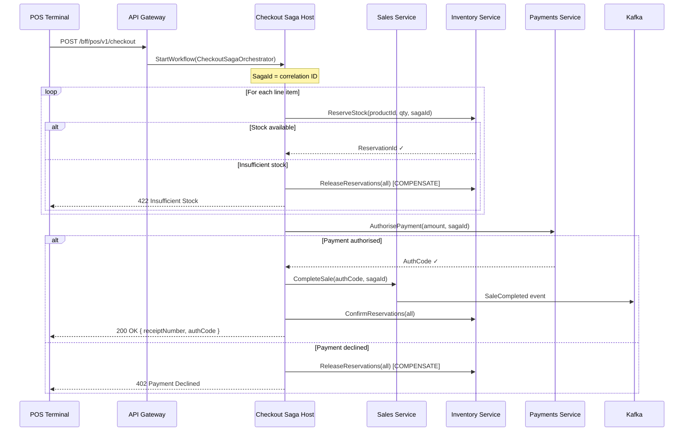

# Saga Orchestration — Checkout Workflow

## Saga Pattern Choice

This platform implements **both** saga styles per context:

| Style | When Used | Services |
|---|---|---|
| **Orchestration** | Long-running, complex compensation, need central visibility | Checkout, Refund |
| **Choreography** | Simple reactive chains, decoupled teams | Inventory sync, AI updates |

---

## Checkout Saga (Orchestration via Dapr Workflow)



---

## Saga State Machine

```
                 ┌─────────────────┐
                 │    STARTED      │
                 └────────┬────────┘
                          │
                          ▼
                 ┌─────────────────┐
                 │  RESERVING_STOCK│◄──────── Retry (up to 3x, exponential)
                 └────────┬────────┘
                          │ All reserved
                          ▼
                 ┌─────────────────┐
                 │ AUTHORISING_PMT │◄──────── Retry (up to 2x)
                 └────────┬────────┘
                          │ Authorised
                          ▼
                 ┌─────────────────┐
                 │ COMPLETING_SALE │
                 └────────┬────────┘
                          │ Completed
                          ▼
                 ┌─────────────────┐
                 │   COMPLETED ✓   │
                 └─────────────────┘

Compensation flows (left side):
  Any step fails → COMPENSATING state
    ├── Release all inventory reservations
    ├── Void partial sale if created
    └── → FAILED state (with reason)

Timeout (saga-level, 30s default):
    → TIMED_OUT → Compensate all
```

---

## Idempotency in Sagas

Every activity uses a deterministic idempotency key:
```
saga-reserve-{sagaId}-{productId}    ← ReserveInventoryActivity
saga-payment-{sagaId}                 ← AuthorisePaymentActivity
saga-complete-{sagaId}                ← CompleteSaleActivity
saga-confirm-{sagaId}-{reservationId} ← ConfirmInventoryActivity
saga-release-{sagaId}-{reservationId} ← ReleaseInventoryActivity
```

If Dapr Workflow retries an activity (due to crash/restart), the downstream
service detects the duplicate key and returns the original result — no
double-charges, no double-reservations.

---

## Event Replay Governance

```
REPLAY APPROVAL WORKFLOW:

1. Operator identifies need for replay
   (e.g., projection bug caused stale read models)

2. Creates Replay Request via admin API:
   POST /api/v1/admin/replays
   {
     "streamPattern": "sale-*",
     "tenantId": "acme",          ← tenant-scoped
     "fromVersion": 100,
     "toVersion": 500,
     "targetProjection": "sale-read-model",
     "dryRun": true               ← must run dry-run first
   }

3. Dry-run analysis:
   - Count events affected
   - Identify potential side effects
   - Estimate duration

4. Approval: requires 2 platform-ops sign-offs (4-eyes)

5. Replay safety guards:
   - Idempotency keys stored: no duplicate business events emitted
   - Read-model UPSERT: safe to replay
   - External calls (payments, email) BLOCKED during replay
   - Audit log: every replayed event stamped with replay_run_id

6. Post-replay validation:
   - Read model consistency check
   - SLO metric comparison (before/after)
   - Audit trail review
```

---

## Refund Saga (Choreography)

```
SaleRefundRequested (command)
    │
    ▼ Sales Service
SaleRefundedEvent → Kafka
    │
    ├──► Payments Service: process refund → PaymentRefundedEvent
    │
    ├──► Inventory Service: restock items → StockReplenishedEvent
    │
    └──► AI Service: update customer history → no event
         (analytics only — fire and forget)
```

Simpler than checkout — no compensation needed for refunds
(refund failure is handled via retry, not saga rollback).
